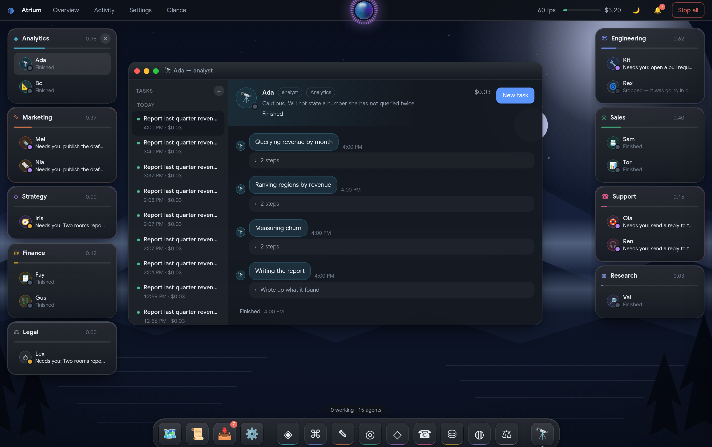

# Atrium

Repo: AgentOS

A single-operator workspace for running scripted software agents against real systems, where every tool call is gated on permission scope, human approval and a spend cap.

It exists to test one question: whether a desktop of permission-scoped "rooms" beats a chat list for supervising many agents at once.

[Product spec and kill criteria](prd.md) - [Code review](REVIEW.md)



## What it does

You give the supervisor one sentence, by voice or by typing. It routes that sentence to a
room; the room's manager agent decomposes it into tasks, assigns them to its workers,
waits, and reports back. Recalling it stands the work down without killing anyone.
Redirecting it carries the artefacts already produced to whichever room takes over.

Everything else is the shell you supervise it from.

| | |
|---|---|
| **Drag** | Geometry is written to the node during the gesture and committed on release, so a window tracks the pointer at refresh rate rather than a render behind it. It lands where you let go; nothing re-arranges itself around you. |
| **Park** | Push a room into either side gutter and it tucks to a 72px rail carrying its colour, its icon and its crew as live faces. Hover scrubs it open at the same height; click or drag restores the rect it had. |
| **Resize** | Eight handles, each pulling its own side with the opposite pinned, clamped to the desk. |
| **Align** | Neighbouring edges and the desk's centre lines pull with a 6px magnet and show a hairline while they hold. |
| **Carry** | A chit carries a mandate from the orb to a room; an approval can be lifted off the queue, and the orb refuses it — a supervisor may carry an approval and may never make one. |

The approvals queue clears with one hand: `j`/`k` to move, `a` to approve, `A` to approve
and stop asking, `r` to reject, `⏎` to open the room. Or swipe the card — it follows your
hand and only past 88px does releasing mean it. Every decision waits eight seconds behind
an Undo before it commits.

Positions, sizes, stacking, what is parked and what you closed survive a reload, and are
pulled back onto the screen if you return on a smaller one. Cost reads as agent hours
rather than currency. `⌘K` talks to the supervisor, `⌘\` opens the queue, `⌥1-9` focuses
a room, `Escape` closes — or cancels a drag without closing anything.

The web build installs as a PWA: a manifest, icons, and a service worker that precaches
the shell and never serves `/api` from disk. Apps that are not needed to paint the desk
are fetched when opened.

## Requirements

- Node 20 or newer. No engine is declared in the manifests; Vite 6 and the built-in `node --test` runner set the floor.
- PostgreSQL, reachable locally. The login you connect as must be able to `CREATE ROLE` and `GRANT` — `server/scripts/migrate.ts` provisions one database role per room.
- `git` on `PATH`. The engineering room shells out to it against a generated workspace repo.
- No LLM API key. Agent reasoning is deterministic TypeScript, not a model call.
- Optional: a GitHub repo and token, only if you want `github.pr.open` to open a real pull request instead of pushing to a local bare remote.

## Run it

```bash
git clone https://github.com/nvkudva/AgentOS.git
cd AgentOS
createdb atrium
npm install
npm run setup          # migrate + seed + build the workspace repo + build the UI
npm run serve          # http://localhost:8788
npm run agents:start   # wake every seeded agent
```

Nothing in the codebase loads a `.env` file — `.env.example` is a list of variables to export yourself. The defaults below work against a local `atrium` database owned by an `atrium` role.

When it works, `http://localhost:8788` shows the desktop with the seven seeded rooms, and `npm run status` prints the same state from the terminal.

## Configuration

| Variable | Required | What it is |
|---|---|---|
| `PGHOST` / `PGPORT` | No | Postgres address. Defaults `127.0.0.1:5432` |
| `PGDATABASE` | No | Database name. Default `atrium` |
| `PGUSER` / `PGPASSWORD` | No | Main pool login. Both default to `atrium` |
| `PORT` | No | HTTP port for the server. Default `8788` |
| `ATRIUM_TICK_MS` | No | Scheduler poll interval. Default `400` |
| `ATRIUM_WORKSPACE` | No | Path to the git repo the engineering room edits. Default `../workspace` |
| `ATRIUM_URL` | No | Base URL the CLI scripts talk to. Default `http://localhost:8788` |
| `ATRIUM_GH_REPO` | No | `owner/name`. Unset, branches push to a local bare remote and the tool result says `mode: "local"` |
| `GH_TOKEN` | No | GitHub token, read only when `ATRIUM_GH_REPO` is set. `GITHUB_TOKEN` also works |

`.env.example` also lists `AGENT_DRIVER` and `ANTHROPIC_API_KEY`. No code reads either one.

## How it works

`server/src/index.ts` is a bare `http.createServer` — one SSE stream, a JSON dispatcher for `/api/*`, and static files from `web/dist`. `server/src/runtime/scheduler.ts` polls Postgres for agents in state `working` and advances each one step per tick; a step is an entry in a hand-written policy array in `server/src/policies/index.ts`.

Every step's tool call goes through one function, `server/src/runtime/toolbelt.ts`. It checks room status, then the room's tool grants, then approval by blast radius, then charges the spend cap transactionally, and only then executes. Each branch appends to an append-only `event` table first.

Scope is enforced twice: by that gate, and by a real Postgres role per room with real `GRANT`s (`server/src/provision.ts`). `server/test/scope.test.ts` proves the database layer holds even when the application check is bypassed. `server/src/replay.ts` folds the event log back into room, agent and run projections, and `server/test/replay.test.ts` asserts the fold matches the live tables.

The UI in `web/src` is React over the same SSE stream — a window manager (`web/src/desktop/wm.ts`), a voice orb that can start and stop agents but deliberately cannot approve anything, and one approvals queue.

## Status

Working today: the permission gate, per-room Postgres roles, transactional budgets, the approvals queue, loop kills, the event log and its replay check, and runtime room creation. The analytics, engineering, support, marketing, finance and sales rooms all touch real Postgres tables or a real git repo.

Not built: authentication. Every `/api/*` route is unauthenticated and the server sends `access-control-allow-origin: *`, so any host or web page that can reach the port can approve high-blast actions, raise budgets and create rooms. Bind it to localhost and treat it as a single-machine tool. Room database roles are also created with a password equal to the role name.

Unmeasured: the desktop-versus-chat-list thesis. Milestone 7 — a real operating week — has not run, so `npm run report:thesis` has no verdict to print. The kill criteria in [`prd.md`](prd.md) §1a are targets, not results.

Tests are four integration suites under `server/test`. They require a Postgres that is already migrated and seeded, `npm test` does not bootstrap one, and there is no CI workflow. `server/src` has no `tsconfig.json` and no typecheck script — `tsx` strips types without checking them.

The known defects are listed with file and line in [REVIEW.md](REVIEW.md).

## License

No licence file yet - all rights reserved.
