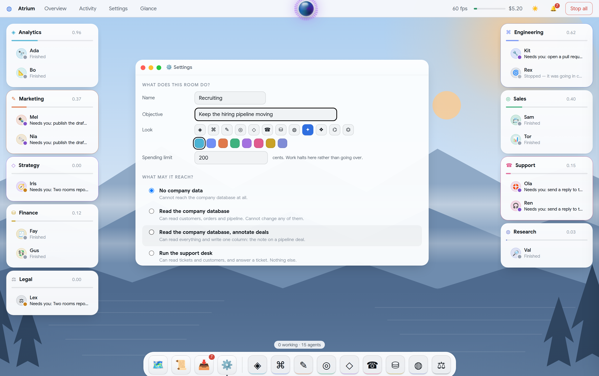
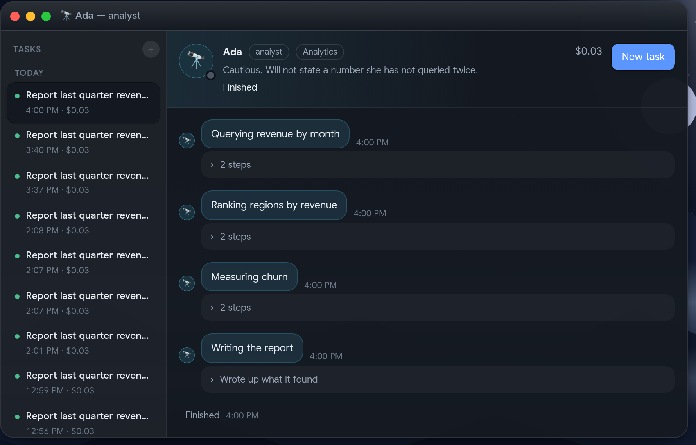
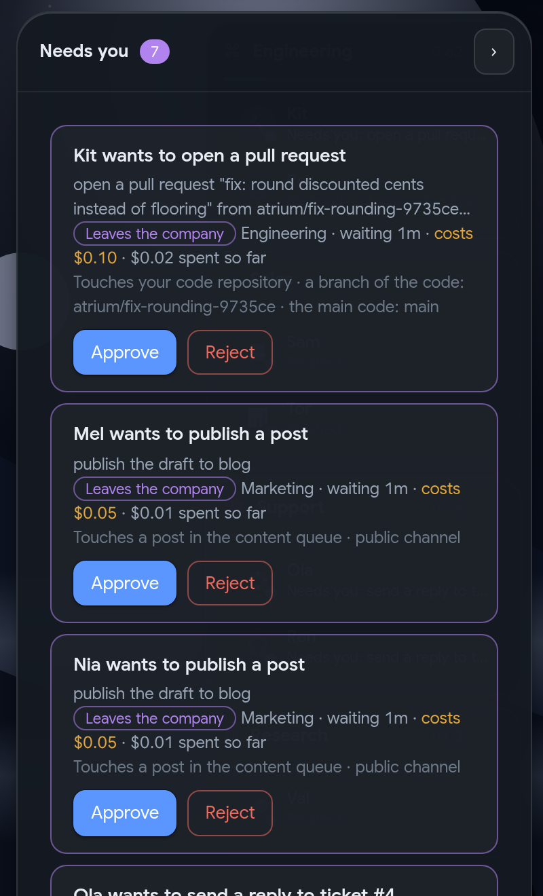
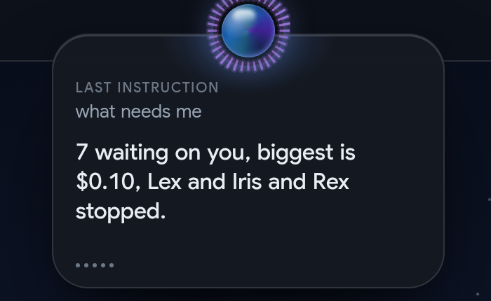
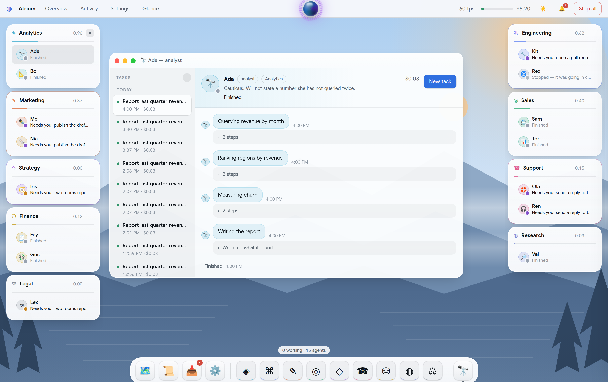
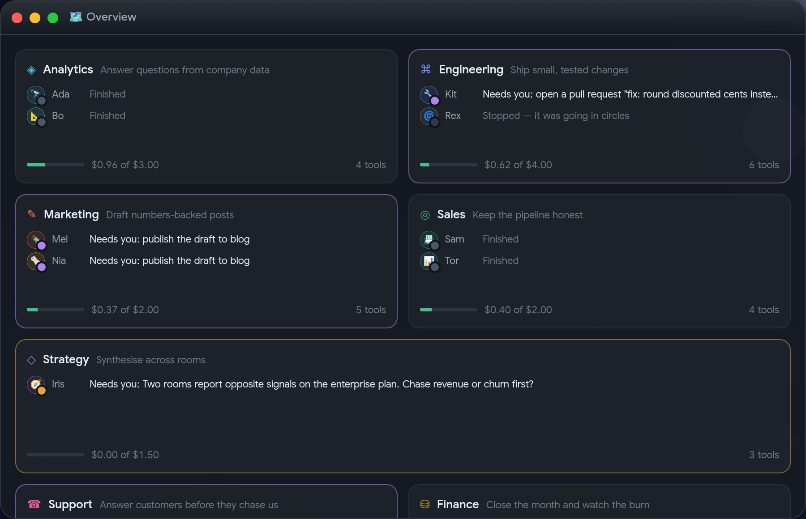

<div align="center">

# Atrium

**An operating system for a company staffed by AI agents.**

One human operator. Many rooms, one per business function. Several agents in every room.
Rooms are permission scopes, not decoration.

</div>


---

## What it is

A desktop OS whose applications are your company's functions.

- **Rooms are the unit.** Analytics, engineering, marketing, sales, support, finance,
  research, strategy — and whatever you add next. A room owns an objective, a budget, a set
  of tools, a memory, a **database identity** and an escalation policy. It is a scope before
  it is a screen.
- **Every room is staffed by several agents**, each with a name, a role, a persona and its
  own step and cost budget. Agents are the workers; rooms are the departments.
- **The shell is an operating system.** Room cards dock to the screen edges, work opens in
  windows, a dock holds apps and rooms, a supervisor orb takes spoken instructions, and one
  queue holds everything that needs a human.

The only thing inherited from games is the face: each agent is a **circular persona avatar**
— an emoji on its own colour with a state ring that breathes while it works. No board, no
map, no isometric art. Everything else is application UI.

---

## Quick start

```bash
createdb atrium                 # PostgreSQL 16
npm install
npm run setup                   # migrate + seed + build the UI
npm run serve                   # http://localhost:8787
npm run agents:start            # wake every agent
npm test                        # 20 tests: scope, budget, approval, replay, provisioning
```

| Command | What it does |
|---|---|
| `npm run dev` | backend on 8787, Vite on 5173 with `/api` proxied |
| `npm run status` | the whole company, from the terminal |
| `npm run agents:start [names…]` | start every agent, or the ones you name |
| `npm run decide <id> approve\|reject` | decide one approval |
| `npm run replay:verify` | fold the event log and diff it against live state |
| `npm run report:thesis` | the desktop-versus-chat-list comparison |

---

## Does the operating system actually beat a chat list?

**Not proven yet, and the honest answer today is "unknown".** Milestone 7 — a real operating
week — has not happened. What exists is the apparatus to settle it, built before the opinion.

Atrium ships **two surfaces over one backend**: the desktop, and **Activity** — a real chat
list with threads, live status and the same approvals queue, deliberately not a strawman.
Both record to `observation_log`; `npm run report:thesis` prints the comparison and evaluates
pre-registered kill criteria (see [`prd.md`](./prd.md) §1a).

**The OS loses if, over a real week:** the glance test is not ≥2× faster on the desktop;
blocked-agent latency is not lower; escalations do not sit for less time; or the operator
drifts back to Activity anyway. If any two fail, this section will say the chat list won.

### What a few hours of operating it did show

Weak evidence — one operator, short sessions — recorded because it is what there is.

- **The calm signal works.** With fifteen agents across nine rooms, the rails answer "does
  anything need me?" without reading a word. Only rooms needing a human get a coloured edge.
- **Peripheral awareness is real, but small at nine rooms.** Nine cards fit in one glance; so
  does a nine-thread list. The claim is untested at the scale where it should matter. Overview
  renders 30 live room cards at **60fps**, so the rendering is not the limit — the experiment is.
- **The approvals queue, not the desktop, did the most work.** Every decision came from that
  one list, and that list would bolt onto a chat client just as well. It is the strongest
  current argument *against* the thesis, and why the criteria measure the glance test rather
  than satisfaction.

---

## What is genuinely real

Verified in this repository, not mocked.

| Room | Real effect | Evidence |
|---|---|---|
| **analytics** | queries real PostgreSQL (`bizdata`: 120 customers, 900 orders, 40 deals) through its **own DB role** | reports built from real aggregates; the role can `SELECT` and cannot `UPDATE` (test) |
| **engineering** | reads a real git repo, patches it, runs the **real test suite**, pushes a **real branch**, opens a PR | commits in `workspace/`, branches in `workspace-remote.git`; the suite genuinely fails before the fix and passes after |
| **support** | reads a real ticket table and **sends a real reply** once approved | `support.ticket` rows moving `open → answered`, reply stored |
| **marketing** | writes a real row into the real content queue, publishes only after approval | `content_queue` rows moving `draft → published` |
| **finance** | closes the month from the real orders table | a memo with real paid/refunded totals |
| **sales** | reads pipeline, writes a real annotation through a role granted `UPDATE (note)` on one column | `bizdata.pipeline.note` |
| **research / strategy / legal** | read every room's shared notes, check a number, escalate to you | briefs citing the other rooms |

Money, budgets, kills, approvals and the event log are all real. **Agent reasoning is not:**
there is no LLM API key in this environment, so policies are deterministic programs that
choose real tools and do real work. `LlmDriver` is the same interface — set
`ANTHROPIC_API_KEY` and `AGENT_DRIVER=llm`. Stated rather than hidden, because a pretty
runtime over a fake claim proves as little as a pretty dashboard over fake agents.

Likewise `github.pr.open`: with `ATRIUM_GH_REPO` + `GH_TOKEN` it opens a pull request on
github.com. Without them it still **really pushes the branch** to a local bare remote and
returns `mode: "local"`. It never reports a PR that does not exist.

---

## Rooms are permission boundaries

The load-bearing idea. If rooms were only visual grouping, a tagged chat list would be
strictly better and this project should not exist.

Every agent action passes one gate — [`runtime/toolbelt.ts`](server/src/runtime/toolbelt.ts) —
in this order:

1. **room status** — a capped or halted room runs nothing
2. **grant check** — the tool must be in `room.tool_grants`; violations are logged and fail hard
3. **approval gate** — by blast radius; irreversible always needs a human
4. **budget charge** — transactional, so caps halt rather than overrun
5. **execute** — only now does anything real happen

Scoping is defended twice: above the database by that gate, and inside it by **per-room
Postgres roles**. `atrium_engineering` has no grant on `bizdata`, so even a bug in our code
cannot leak analytics data — Postgres refuses.

```
✓ a room cannot call a tool it was not granted        (and the refusal is logged)
✓ a room cannot act on another room by naming it
✓ sql.query refuses anything that writes
✓ the engineering database role has no grant on business data
✓ the analytics role can read business data but not write it
✓ a room cannot read another room's private artifacts
✓ repo tools cannot escape the workspace
```

---

## Rooms are data, not code



Adding a function to the company is a form, not a deploy. One call — `provisionRoom` —
writes the room, creates its **own Postgres role**, applies exactly the grants its access
profile allows, and inserts its agents. The rooms that ship go through that same call; if
seeding kept a private path, "a room is data" would only be true of rooms created later.

Jobs declare the tools they need, so a room that would hire for work it cannot do is refused
at creation and the gap is shown while you are still filling the form in.

`test/newroom.test.ts` creates a room at runtime and holds it to the same rules as the
shipped ones — that is **milestone 8**, and the test of whether "room" is really the unit of
the system or just eight hard-coded panels in a costume.

---

## Hard requirements, and what proves each

| # | Requirement | Where | Proof |
|---|---|---|---|
| R1 | every action logged and replayable | `event` is append-only; `src/replay.ts` folds it | `npm run replay:verify` → *replay matches live state exactly* |
| R2 | nothing irreversible without approval | toolbelt step 3; the card carries action, cost, touches | an approval is single-use and bound to its arguments (test) |
| R3 | caps halt, never overrun | `runtime/budget.ts`, charged in the same transaction | 3¢ cap, 1¢ tool — spends exactly 3¢, room goes `capped`, the over-cap call has **no** side effect |
| R4 | loops killed by budget, not by noticing | step budget, cost budget, repeat-signature detector | the seeded `Rex` agent spins on purpose and dies `killed: loop_detected` |
| R5 | state survives refresh | agents run server-side; the browser holds none | runs keep stepping with zero browsers connected |

Plus a global **Stop all** that refuses every tool call while engaged.

---

## The shell

<table>
<tr>
<td width="55%"></td>
<td width="45%"></td>
</tr>
</table>

**Rooms are windows.** Drag one anywhere. Drop it on the **left or right edge** and it joins
that rail; on the **top or bottom** and it becomes a strip; in a **corner** and it tucks away
— 90% off screen with a 10% handle in the room's colour. Only rooms snap; work floats,
because the work belongs in the middle and the furniture at the edges.



**The orb** is a layered sphere — two counter-rotating plasma fields under spherical shading,
a glass dome, a rim light — ringed by 36 bars **driven by the real microphone** while it
listens. It runs and stops agents, opens rooms and teammates, switches theme and answers
*"what needs me?"* aloud. It deliberately **cannot approve anything**: speech recognition is
the wrong place for an irreversible decision, so "approve the PR" brings you the card and
waits for a click.

**Apps open centred in the free desktop** — the stage minus any docked rails — and maximise
to that same area, so a window never opens underneath a rail.

**Nothing reads like a developer tool.** The operator is an office worker running a team of
agents, so the interface never shows a tool name, an event type, a millisecond or a cent.
`sql.query · touches bizdata.orders · 1¢` becomes *"Looked something up in the company
database"*; `agent.killed loop_detected` becomes *"Stopped — it was going in circles"*;
`blast_radius: high` becomes *"Leaves the company"*. There is no monospace anywhere.

One radius scale runs the whole app — 26 shell, 18 window, 12 card, 9 control, pills round —
with 4-point spacing, four elevation tiers and a single glass recipe on exactly four
surfaces. Type is **Google Sans, self-hosted**, so it reads the same offline and on any
machine.

**Themes and frames.** Light, dark and auto. Effects cost frames — a full-width
`backdrop-filter`, or a rotating gradient inside a clipped circle, is free on a GPU and
halves the frame rate in software rendering. So Atrium watches its own frame rate
continuously and trades effects for frames when it struggles: glass becomes flat, the orb's
core stops turning, and both return with hysteresis. **40–44fps with everything on becomes a
steady 60 once it adapts.**



---

## Overview



Every room and its crew on one card grid — an app on the stage, not the whole screen, which
is what keeps the chat-list comparison honest: both surfaces are windows you open.

---

## Layout

```
prd.md                       the spec, thesis and kill criteria
db/migrations/               schema, the business data, the support desk
server/src/
  provision.ts               a room is data: role, grants, agents, from one description
  runtime/toolbelt.ts        the single gate every agent action passes
  runtime/budget.ts          transactional spend caps that halt
  runtime/scheduler.ts       the step loop, kills, approval parking
  replay.ts                  the fold that defines what the projections mean
  tools/                     real tools: postgres, git, github, tickets, content queue
  policies/                  what each agent does, step by step
web/src/
  desktop/wm.ts              window manager: snap lanes, corner tucking, z-order
  desktop/Orb.tsx            the supervisor: sphere, ring, microphone
  desktop/commands.ts        its grammar — deliberately deterministic, never approves
  desktop/Wallpaper.tsx      the generated landscape
  apps/AgentApp.tsx          a teammate's workspace: tasks left, conversation right
  apps/NewRoom.tsx           the room creator
  lib/humanize.ts            one place that turns the system's language into English
  lib/perf.ts                measures itself, drops effects rather than frames
workspace/                   a real git repo the engineering room really edits
```

---

## Open decisions

Each was taken as a reversible default and is argued in [`prd.md`](./prd.md) §7.

- **D1 — build the runtime, don't wrap an orchestrator.** The product claim *is* the
  scoping and interruption layer every orchestrator owns. ~400 lines; reasoning stays
  pluggable behind `LlmDriver`.
- **D2 — gate on blast radius, not a fixed rule.** `low` runs free, `medium` runs and
  notifies, `high` — irreversible or public — always asks. "Approve and always" can raise
  autonomy per room but never below `high`.
- **D3 — shared artifact store, no cross-room messaging in v1.** Messaging is the fastest
  way to dissolve the boundary the design rests on.

---

## Milestones

| | | |
|---|---|---|
| 1 | Data model and scoped permissions | ✅ |
| 2 | One room, one real working agent | ✅ |
| 3 | Live state streaming to the UI | ✅ |
| 4 | Approval and escalation queue | ✅ |
| 5 | Budgets and kill switches | ✅ |
| 6 | Three rooms doing real work concurrently | ✅ |
| 7 | Run a real week through it, and write the verdict | ⬜ needs an operator |
| 8 | Add a room without touching the shell | ✅ |

## Not in v1

Multi-human teams. Agent-to-agent negotiation. A marketplace. Mobile. Any game surface
beyond the circular persona avatar.
